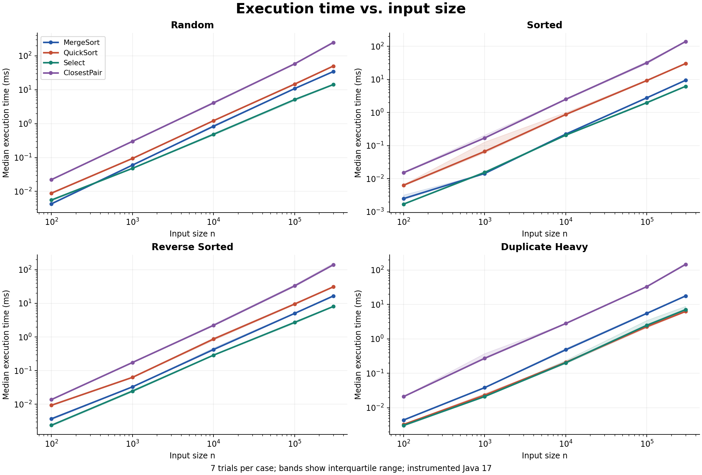
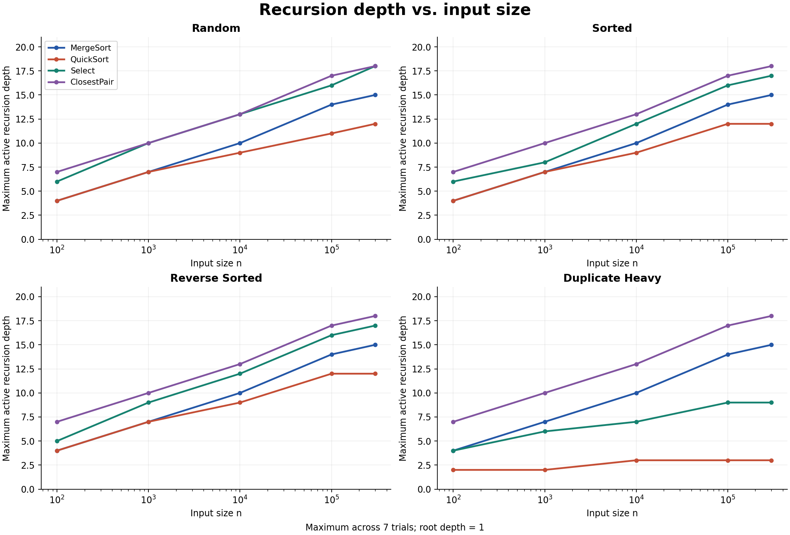
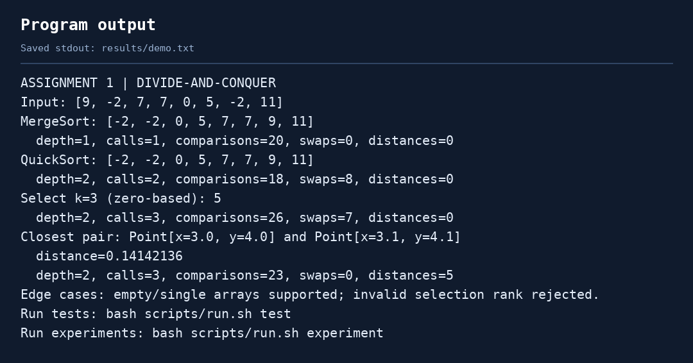
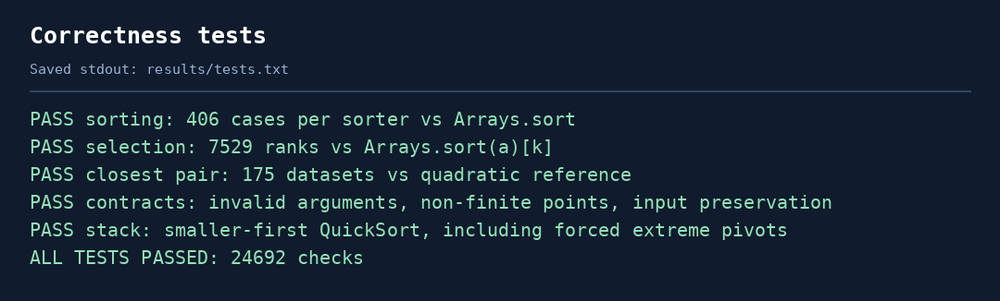
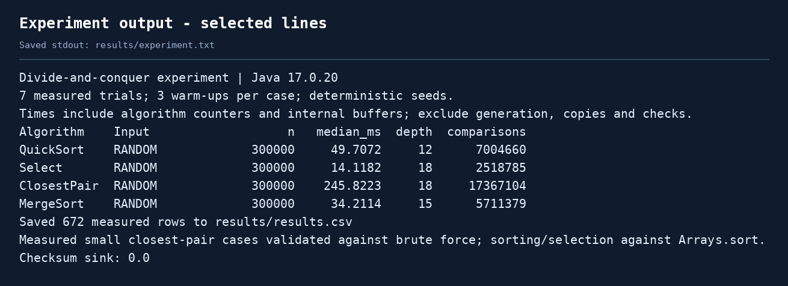

# Assignment 1: Divide-and-Conquer Algorithms

## 1. Project overview

This project implements four algorithms in Java: MergeSort, randomized QuickSort, Deterministic Select, and Closest Pair of Points. The goal is to check their correctness and compare their time complexity with experimental results.

The project measures execution time, recursion depth, comparisons and other operations. The results are saved in CSV files and shown in tables and plots below.

## 2. How to run

Use **JDK 17 or newer**. Open a terminal in the project folder.

**Windows PowerShell:**

```powershell
powershell -ExecutionPolicy Bypass -File scripts/run.ps1 demo
powershell -ExecutionPolicy Bypass -File scripts/run.ps1 test
powershell -ExecutionPolicy Bypass -File scripts/run.ps1 experiment
```

**Linux, macOS or Git Bash:**

```bash
bash scripts/run.sh demo
bash scripts/run.sh test
bash scripts/run.sh experiment
```

`demo` shows examples, `test` checks correctness, and `experiment` records new measurements. The Bash/Java commands were tested. The Windows and Maven launch options are included but were not tested in the measurement environment.

| Folder or file | Contents |
| --- | --- |
| `src/daa/` | Algorithms, point class, metrics and experiment runner |
| `tests/daa/` | Correctness tests |
| `results/` | CSV files and saved program output |
| `docs/plots/` | Performance plots |
| `docs/screenshots/` | Images of saved output |
| `pom.xml` | Maven configuration |

## 3. Algorithm analysis

### MergeSort

MergeSort divides the array into two halves, sorts each half and merges them. The merge step takes linear time. One auxiliary array is created and reused. Parts with at most 24 elements are sorted using Insertion Sort.

The recurrence is:

`T(n) = 2T(n/2) + Θ(n)`

There are two half-size subproblems and linear work to combine them. By **Master Theorem, case 2**, the time complexity is **Θ(n log n)**. Extra space is **O(n)** for the buffer, including an O(log n) recursion stack. The fixed cutoff does not change the overall complexity.

### QuickSort

QuickSort chooses a random pivot and partitions the array in place into three parts: smaller values, equal values and larger values. The equal part needs no further sorting, which helps with duplicates.

The algorithm recurses on the **smaller part** and handles the larger part with a loop. Each nested call gets at most half the current range, so the stack uses **O(log n)** space even with bad pivots.

For balanced partitions, `T(n) = 2T(n/2) + Θ(n)` gives Θ(n log n) by Master Theorem. Random pivots give **expected Θ(n log n)** time for distinct values, although not every split is balanced. In the worst case, `T(n) = T(n-1) + Θ(n)`, giving **Θ(n²)**. An all-equal array takes Θ(n) with this three-way partition.

### Deterministic Select

This algorithm finds the element that would be at position `k` in a sorted array, without sorting the whole array. Positions start at zero.

The array is divided into groups of five. Each small group is sorted, and its median is moved to the beginning of the same array. The median of these medians becomes the pivot. After an in-place three-way partition, the search continues only in the part containing `k`.

The worst-case recurrence is bounded by:

`T(n) <= T(ceil(n/5)) + T(7n/10 + O(1)) + Θ(n)`

At least about 30% of the elements can be discarded, leaving at most about 70%. The ordinary Master Theorem does not directly apply because the subproblems have different sizes. The **Akra-Bazzi intuition** is that their size fractions add to `1/5 + 7/10 = 0.9 < 1`. Ignoring rounding, the total work decreases geometrically across levels, giving **O(n)**. Together with the linear worst-case lower bound, this gives **Θ(n)** time. Extra space is **O(log n)** for recursion; no extra array is needed.

### Closest Pair of Points

The points are first sorted by x-coordinate and divided into two halves. Each half returns its closest pair. A closer pair across the boundary must lie in a narrow strip around the dividing line.

The strip is checked in y-order. For each point, the algorithm checks at most seven following points. The two halves are merged by y in linear time; the strip is not sorted again at each level.

The recurrence is `T(n) = 2T(n/2) + Θ(n)`. **Master Theorem, case 2**, gives **Θ(n log n)**. The initial x-sort also fits this bound. Extra space is **O(n)** for working arrays, including the O(log n) recursion stack. Duplicate points are allowed and give a distance of zero.

## 4. Testing

The test suite completed **24,692 checks successfully**.

| Algorithm | Correctness checks |
| --- | --- |
| MergeSort and QuickSort | 406 datasets per sorter compared with `Arrays.sort()`: random, sorted, reversed, duplicate, empty and single-element arrays |
| Deterministic Select | 7,529 ranks compared with `Arrays.sort(a)[k]`, including more than 100 random datasets, minimum/maximum ranks and duplicate values |
| Closest Pair | 175 datasets compared with O(n²) brute force, including datasets of 2,000 points; a separate 100,000-point dataset has a known answer |

Additional tests cover invalid arguments, integer limits and QuickSort with deliberately bad pivots. The complete output is in [results/tests.txt](results/tests.txt).

## 5. Experimental results

### Method

The experiments used **OpenJDK 17.0.20 on Linux**. Five input sizes were tested: 100, 1,000, 10,000, 100,000 and 300,000. Input types were random, sorted, reverse-sorted and duplicate-heavy.

There were 12 initial warm-up runs per algorithm/type at n = 10,000, then three warm-ups and **seven measured runs per case**. Fixed random seeds make the inputs reproducible. The integer duplicate-heavy input contains values from 0 to 7; point inputs use an 8-by-8 grid. Sorted points are ordered by x, then y.

Time is measured with `System.nanoTime()`. Input generation and reference checks are outside the timed section; algorithm buffers and operation counters are included. Tables show **median time** and **maximum recursion depth** across the seven runs. Depth counts active algorithm calls, starting at 1; loops do not increase it.

The CSV contains **672 measurements**, including extra small Closest Pair and brute-force runs. Other counters include comparisons, swaps, recursive calls and distance calculations. Comparison counts represent different operations for integer and point algorithms, so they should mainly be compared within the same algorithm. Environment details are in [environment.txt](results/environment.txt).

### Time on random inputs

Times are in milliseconds.

| n | MergeSort | QuickSort | Select | ClosestPair |
| --- | --- | --- | --- | --- |
| 100 | 0.0043 | 0.0089 | 0.0056 | 0.0223 |
| 1,000 | 0.0597 | 0.0938 | 0.0480 | 0.3001 |
| 10,000 | 0.8350 | 1.2187 | 0.4832 | 4.0844 |
| 100,000 | 10.7726 | 14.5749 | 5.1023 | 57.7653 |
| 300,000 | 34.2114 | 49.7072 | 14.1182 | 245.8223 |

### Different input types at n = 300,000

Times are in milliseconds.

| Input type | MergeSort | QuickSort | Select | ClosestPair |
| --- | --- | --- | --- | --- |
| Random | 34.2114 | 49.7072 | 14.1182 | 245.8223 |
| Sorted | 9.4351 | 30.2245 | 6.1840 | 139.8686 |
| Reverse-sorted | 16.5764 | 30.9663 | 8.0778 | 139.6626 |
| Duplicate-heavy | 17.6562 | 6.2484 | 7.0523 | 145.2728 |

### Recursion depth on random inputs

| n | MergeSort | QuickSort | Select | ClosestPair |
| --- | --- | --- | --- | --- |
| 100 | 4 | 4 | 6 | 7 |
| 1,000 | 7 | 7 | 10 | 10 |
| 10,000 | 10 | 9 | 13 | 13 |
| 100,000 | 14 | 11 | 16 | 17 |
| 300,000 | 15 | 12 | 18 | 18 |

All size/type combinations are in [EXPERIMENT_TABLES.md](docs/EXPERIMENT_TABLES.md). Raw measurements are in [results.csv](results/results.csv); aggregated results are in [summary.csv](results/summary.csv).

### Plots



The time plot uses logarithmic axes. Shaded areas show the middle half of the measured times.



The depth plot uses a logarithmic input-size axis and a linear depth axis.

## 6. Discussion

**Do the results match the theory?** The operation counts support the expected trends. On random inputs from 1,000 to 300,000, MergeSort comparisons divided by `n log2 n` remain around 1.04-1.08. Select comparisons per element stay around 7.55-8.40, supporting linear growth. Measurements support the analysis but do not prove the bounds.

**How does input structure affect performance?** Sorted input reduces work in Insertion Sort steps. QuickSort handles duplicates efficiently because equal values are grouped together. At n = 300,000, its measured depth is 3 for duplicate-heavy input and 12 for random input. Already sorted points also make the initial x-sort cheaper.

**Why recurse on QuickSort's smaller part?** This limits the number of active calls to O(log n). It saves stack space but does not remove the O(n²) time worst case. The bad-pivot test demonstrates this: over one million comparisons with depth 1.

**Why is Median-of-Medians linear?** Groups of five guarantee that a constant fraction can be discarded. Pivot selection uses about n/5 elements, and the remaining search uses at most about 7n/10. Their fractions add to less than one, allowing a linear total bound.

**Why is Closest Pair faster than brute force?** Brute force checks `n(n-1)/2` pairs. Divide-and-conquer uses linear work at each of O(log n) levels. For 2,000 random points, the measured medians were **0.7016 ms** and **35.5501 ms**, respectively: about **50.7 times faster** in this run. Large inputs use only the fast implementation.

**What practical factors affect time?** JVM compilation, garbage collection, cache access and other processes can change the results. Warm-ups and repeated runs reduce some variation. Counters also add overhead. The four algorithms solve different tasks, so their times do not show that one is universally better.

## 7. Reflection

The main lesson from this project is that running time and recursion depth measure different things. QuickSort can use little stack space while still doing many comparisons. MergeSort also shows why reusing a buffer is useful: it avoids creating a new array at every recursive step.

The main implementation challenges were handling duplicates in selection and maintaining the correct point order in Closest Pair. Three-way partitioning and merging by y-coordinate address these problems. Checking the results against simple reference methods helped verify correctness. A useful next step would be to compare different Insertion Sort cutoffs and repeat the experiments on another computer.

## 8. Program output

These images show the actual saved console output, rendered for readability. The original text logs are in `results/`.







## 9. GitHub workflow and submission

This source snapshot does not contain Git history. Start a new repository, record actual changes in commits, and use feature branches before merging into `main`. The included GitHub Actions configuration builds and tests the project on Linux and Windows after publication; it has not run on GitHub yet.

The report and analysis are in this **README.md**. The official Moodle submission must be a **working GitHub repository link**. Publication is still required; instructions are in [SUBMISSION_RU.md](docs/SUBMISSION_RU.md).

## References

- Course handout: *Assignment 1: Divide-and-Conquer Algorithm Analysis*.
- MIT, [Lecture 6: Order Statistics](https://ocw.mit.edu/courses/6-046j-introduction-to-algorithms-sma-5503-fall-2005/ca4e5673e2b64eacc5691cda564cba49_lec6.pdf).
- Princeton Algorithms, [ClosestPair documentation](https://algs4.cs.princeton.edu/code/javadoc/edu/princeton/cs/algs4/ClosestPair.html).
